# Architecture Diagrams - Enterprise Security & Compliance

Comprehensive Mermaid diagrams for the Security & Compliance infrastructure.

## 1. Overall Security Architecture

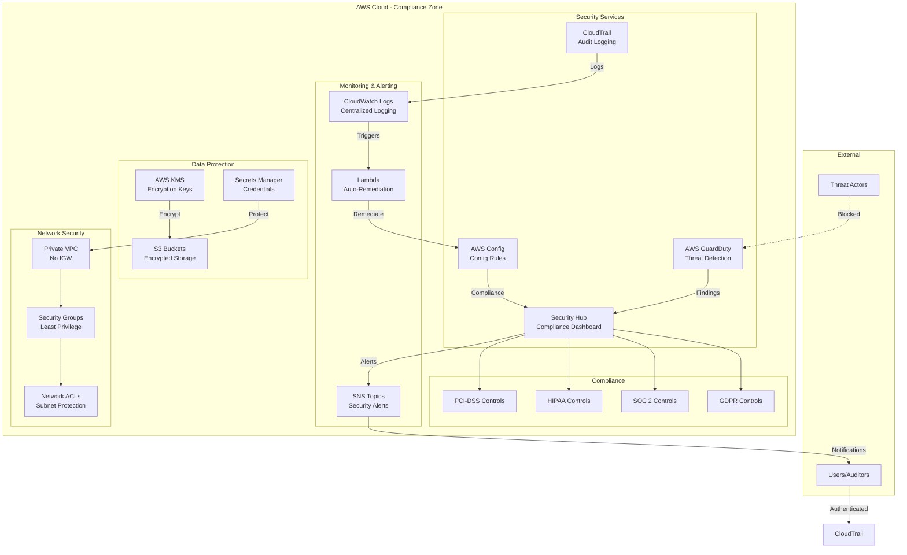

## 2. Compliance Framework

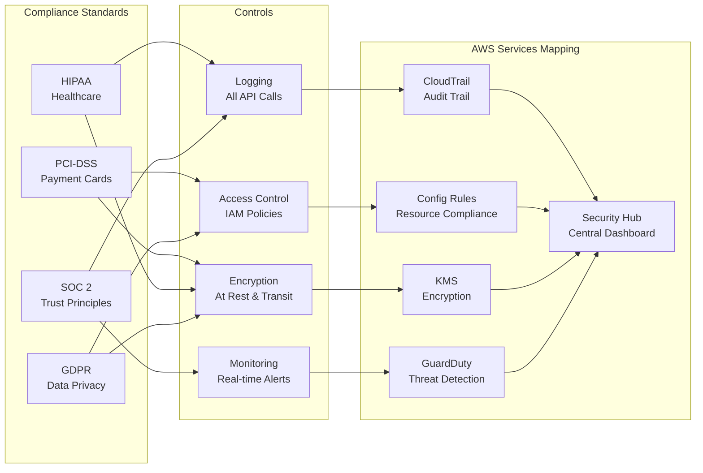

## 3. GuardDuty Threat Detection Flow

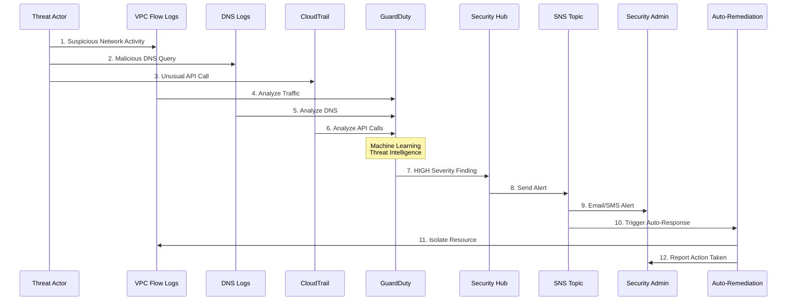

## 4. Data Encryption Architecture

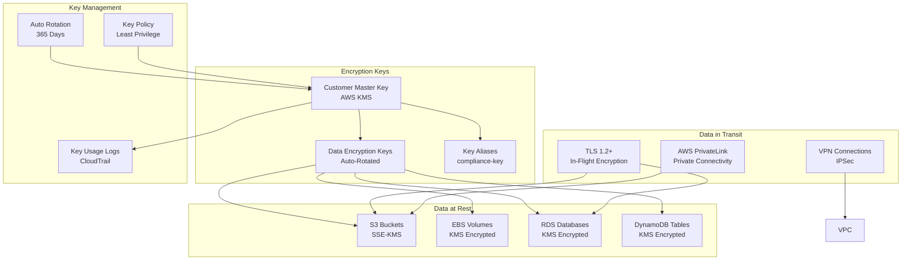

## 5. CloudTrail Audit Flow

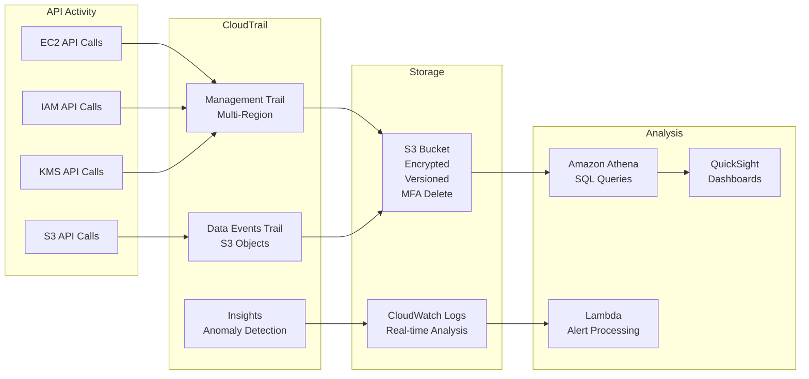

## 6. AWS Config Compliance Monitoring

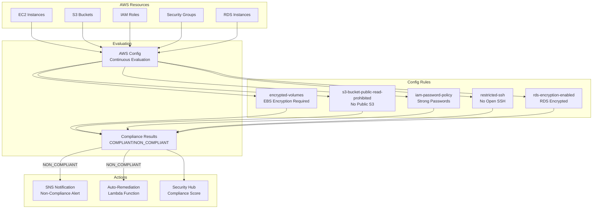

## 7. Security Hub Integration

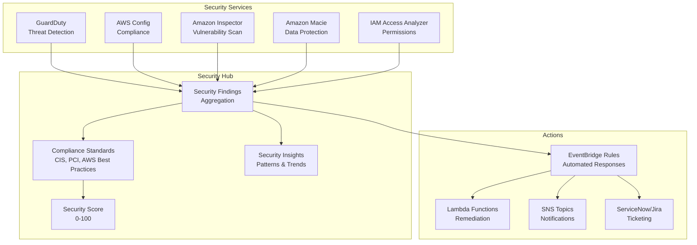

## 8. Incident Response Workflow

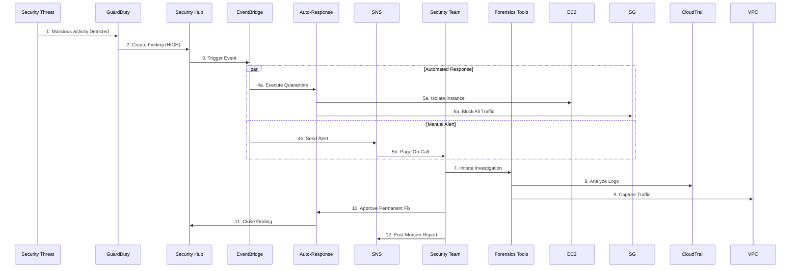

## 9. Network Security Layers

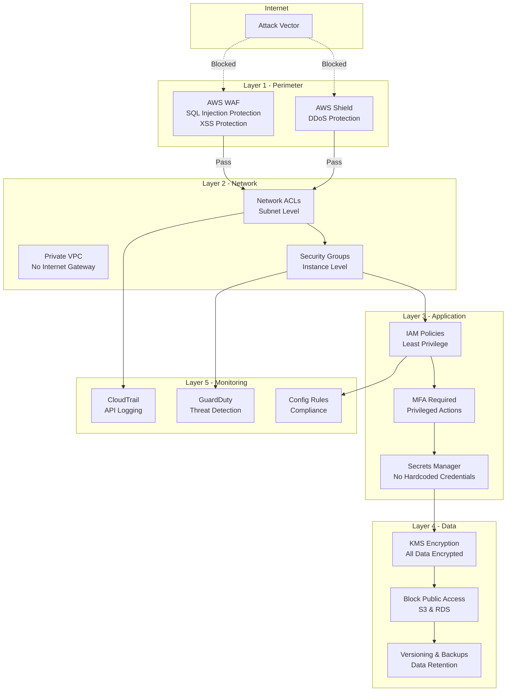

## 10. Compliance Reporting Dashboard

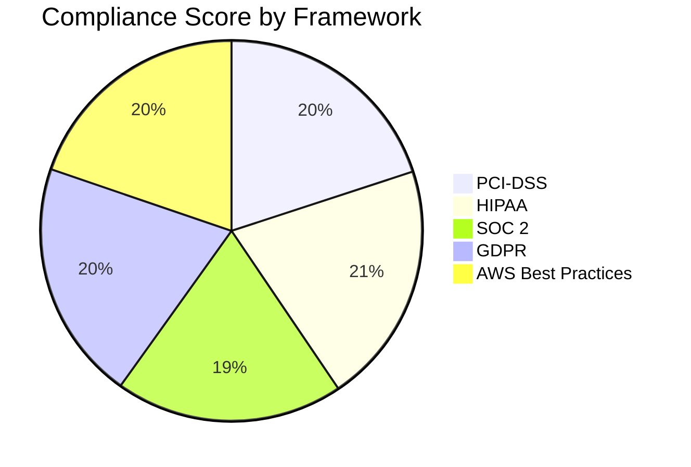

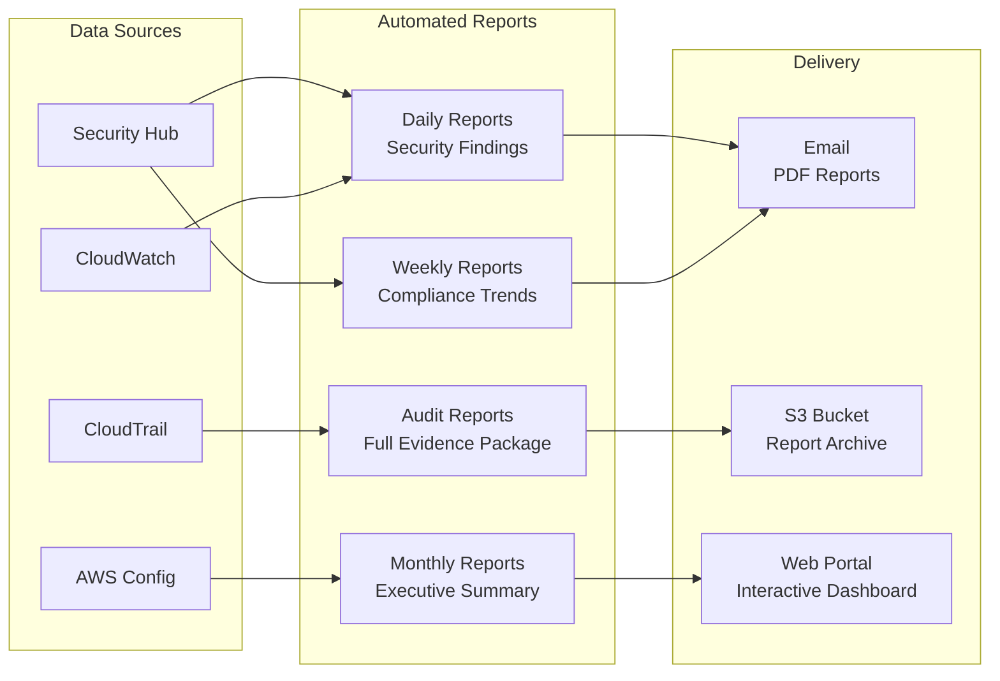

---

## Diagram Legend

- **Solid Lines**: Active data flow
- **Dotted Lines**: Blocked/Failed attempts
- **GREEN**: Compliant/Secure
- **RED**: Non-compliant/Alert
- **YELLOW**: Warning/Review needed

---

## Key Security Features

### 1. Threat Detection
- GuardDuty: ML-powered threat detection
- Security Hub: Centralized findings
- CloudWatch: Real-time monitoring

### 2. Compliance
- AWS Config: Continuous compliance
- CloudTrail: Complete audit trail
- 4 major frameworks (PCI, HIPAA, SOC 2, GDPR)

### 3. Encryption
- KMS: Customer-managed keys
- All data encrypted at rest
- TLS 1.2+ for data in transit

### 4. Network Security
- Private VPC (no IGW)
- Security Groups (least privilege)
- Network ACLs (subnet protection)

### 5. Auto-Remediation
- Lambda functions for response
- EventBridge for orchestration
- SNS for notifications

---

**Author**: Rahul Ladumor  
**License**: MIT 2025
