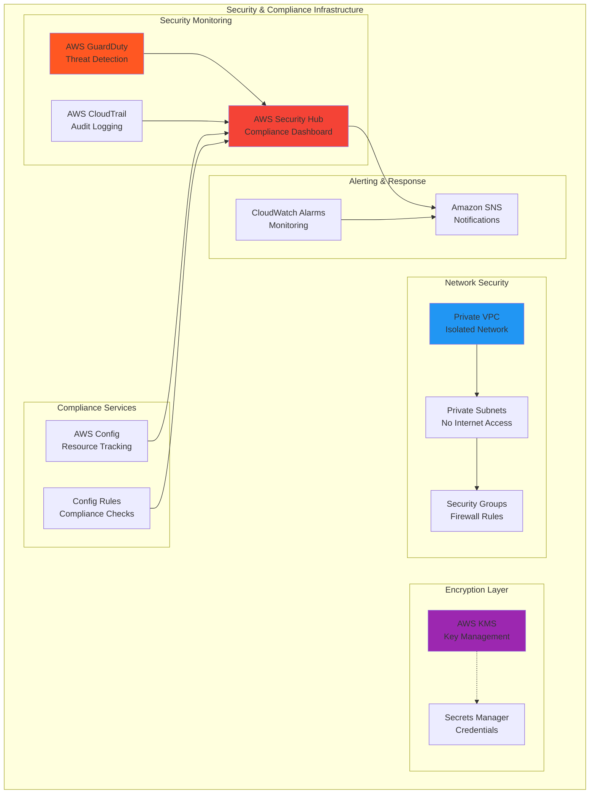

## 🏗️ High-Level Architecture

```mermaid
graph TB
    subgraph Security["Security & Compliance Infrastructure"]
        subgraph Monitoring["Security Monitoring"]
            GuardDuty[AWS GuardDuty<br/>Threat Detection]
            SecurityHub[AWS Security Hub<br/>Compliance Dashboard]
            CloudTrail[AWS CloudTrail<br/>Audit Logging]
        end
        
        subgraph Compliance["Compliance Services"]
            Config[AWS Config<br/>Resource Tracking]
            ConfigRules[Config Rules<br/>Compliance Checks]
        end
        
        subgraph Encryption["Encryption Layer"]
            KMS[AWS KMS<br/>Key Management]
            SecretsManager[Secrets Manager<br/>Credentials]
        end
        
        subgraph Network["Network Security"]
            VPC[Private VPC<br/>Isolated Network]
            PrivateSubnets[Private Subnets<br/>No Internet Access]
            SecurityGroups[Security Groups<br/>Firewall Rules]
        end
        
        subgraph Alerting["Alerting & Response"]
            SNS[Amazon SNS<br/>Notifications]
            CloudWatch[CloudWatch Alarms<br/>Monitoring]
        end
    end
    
    GuardDuty --> SecurityHub
    CloudTrail --> SecurityHub
    Config --> SecurityHub
    ConfigRules --> SecurityHub
    
    SecurityHub --> SNS
    CloudWatch --> SNS
    
    KMS -.-> SecretsManager
    VPC --> PrivateSubnets
    PrivateSubnets --> SecurityGroups
    
    style GuardDuty fill:#FF5722
    style SecurityHub fill:#F44336
    style KMS fill:#9C27B0
    style VPC fill:#2196F3
```
