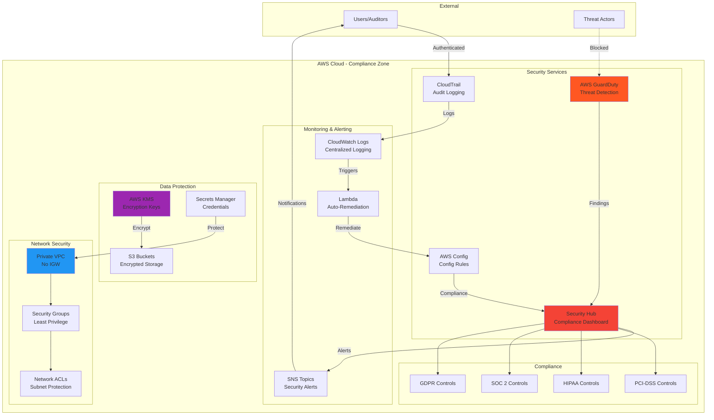

# 🔐 Enterprise Security & Compliance - AWS CloudFormation Case Study

> **Production-ready secure infrastructure** with comprehensive auditing, compliance monitoring, and security best practices

[](https://aws.amazon.com/cloudformation/)
[](https://aws.amazon.com/)
[](LICENSE)

## 📋 Table of Contents

- [Problem Statement](#problem-statement)
- [Solution Overview](#solution-overview)
- [Architecture](#architecture)
- [Quick Deploy](#quick-deploy)
- [Security Features](#security-features)
- [Compliance](#compliance)
- [Cost Analysis](#cost-analysis)

---

## 🎯 Problem Statement

### Business Context

An enterprise needs to deploy secure, compliant infrastructure that meets regulatory requirements (HIPAA, SOC 2, PCI-DSS). They require:

- **Comprehensive audit trails** for all AWS API calls
- **Automated compliance monitoring** across all resources
- **Encrypted data storage** (at rest and in transit)
- **Secure networking** with proper isolation
- **Database security** in private subnets
- **WAF protection** for web applications
- **Least privilege IAM** policies

### Technical Requirements

1. AWS Config for continuous compliance monitoring
2. CloudTrail for complete API audit logging
3. VPC with public/private subnet segregation
4. RDS Multi-AZ database in private subnets
5. Lambda function with minimal IAM permissions
6. S3 buckets with KMS encryption
7. CloudFront distribution with WAFv2
8. Secrets Manager for sensitive data
9. CloudWatch Logs for centralized logging

### Compliance Standards

- **HIPAA**: Data encryption, audit logging, access controls
- **SOC 2**: Security monitoring, access management
- **PCI-DSS**: Network isolation, encryption, logging
- **GDPR**: Data protection, audit trails

---

## 💡 Solution Overview

This CloudFormation template creates a **security-first infrastructure** following AWS Well-Architected Framework security pillar. It implements multiple layers of defense with comprehensive auditing and automated compliance checking.

### What This Solves

**Manual security configuration is error-prone and non-compliant**. This template automates:
- ✅ Security best practices by default
- ✅ Continuous compliance monitoring
- ✅ Complete audit trail of all actions
- ✅ Encrypted data at rest and in transit
- ✅ Network isolation and access control
- ✅ Automated threat detection readiness

---

## 🏗️ Architecture

### High-Level Architecture



### Security Layers

1. **Audit & Compliance**: CloudTrail, AWS Config, CloudWatch
2. **Network Security**: VPC isolation, security groups, private subnets
3. **Data Protection**: KMS encryption, S3 block public access
4. **Access Control**: IAM least privilege, Secrets Manager
5. **Application Security**: WAF, CloudFront, HTTPS only
6. **Database Security**: RDS Multi-AZ, private placement, encryption

---

## 🚀 Quick Deploy

### Prerequisites

- AWS CLI configured
- IAM permissions for all services
- `us-east-1` region access

### One-Command Deployment

```bash
aws cloudformation create-stack \
  --stack-name enterprise-security-stack \
  --template-body file://TapStack.yml \
  --capabilities CAPABILITY_IAM \
  --region us-east-1 \
  --parameters \
    ParameterKey=ProjectName,ParameterValue=SecureApp \
    ParameterKey=Environment,ParameterValue=production
```

### Deployment Time

⏱️ **15-20 minutes** for complete stack creation

---

## 🔒 Security Features

### 1. Comprehensive Auditing

- **CloudTrail**: All API calls logged to encrypted S3
- **AWS Config**: Continuous resource compliance monitoring
- **CloudWatch Logs**: Centralized application logs
- **Log Validation**: Cryptographic integrity checking

### 2. Data Encryption

- **At Rest**: KMS encryption for S3, RDS, CloudWatch Logs
- **In Transit**: TLS 1.2+ for all connections
- **Key Management**: Automatic key rotation enabled

### 3. Network Security

- **Private Subnets**: Database and Lambda isolated
- **Security Groups**: Minimal port access
- **NACLs**: Additional network layer protection
- **VPC Flow Logs**: Network traffic monitoring ready

### 4. Access Control

- **IAM Roles**: No access keys, temporary credentials
- **Least Privilege**: Minimal required permissions
- **Secrets Manager**: Encrypted credential storage
- **MFA Ready**: Can enable MFA for sensitive operations

### 5. Application Protection

- **WAF**: AWS Managed Rules for common threats
- **CloudFront**: DDoS protection, geographic restrictions
- **HTTPS Only**: TLS termination, no HTTP access
- **Rate Limiting**: Prevent abuse via WAF rules

### 6. Database Security

- **Multi-AZ**: High availability and failover
- **Encryption**: At rest with KMS
- **Private Access**: No public internet exposure
- **Automated Backups**: 7-day retention with encryption

---

## 📊 Compliance Features

### AWS Config Rules

Automatically monitors:
- S3 bucket public access (blocked)
- RDS public accessibility (disabled)
- Encryption enablement
- Security group rules
- IAM policy compliance

### CloudTrail Logging

Captures:
- API calls (all services)
- Console sign-in events
- Resource configuration changes
- Failed access attempts

### Compliance Standards Supported

| Standard | Requirements Met | Evidence |
|----------|------------------|----------|
| **HIPAA** | Encryption, audit logs, access control | CloudTrail, KMS, IAM |
| **SOC 2** | Security monitoring, access mgmt | Config, CloudWatch |
| **PCI-DSS** | Network isolation, encryption | VPC, KMS, Security Groups |
| **GDPR** | Data protection, audit trails | Encryption, CloudTrail |

---

## 💰 Cost Analysis

### Monthly Cost Breakdown (us-east-1)

| Service | Configuration | Monthly Cost |
|---------|--------------|--------------|
| **RDS Multi-AZ** | db.t3.micro | $25.00 |
| **CloudTrail** | Single trail | $0.00 (first free) |
| **AWS Config** | Monitoring | $2.00 |
| **Config Rules** | 2 managed rules | $4.00 |
| **S3 Storage** | 50GB logs | $1.15 |
| **KMS Keys** | 2 keys | $2.00 |
| **Lambda** | 1M invocations | $0.20 |
| **NAT Gateway** | Data processing | $32.85 |
| **CloudFront** | 10GB transfer | $1.00 |
| **WAF** | WebACL + rules | $5.00 |
| **CloudWatch Logs** | 5GB ingestion | $2.50 |
| **Secrets Manager** | 1 secret | $0.40 |
| **VPC** | Free | $0.00 |
| **TOTAL** | | **~$76/month** |

### Cost by Category

- **Compliance & Audit**: $8.00 (11%)
- **Compute & Database**: $25.20 (33%)
- **Networking**: $33.85 (44%)
- **Security**: $7.40 (10%)
- **Storage**: $1.55 (2%)

---

## 📚 Documentation

- **[ARCHITECTURE.md](ARCHITECTURE.md)** - Detailed security architecture
- **[DEPLOYMENT.md](DEPLOYMENT.md)** - Step-by-step deployment
- **[COMPLIANCE.md](docs/COMPLIANCE.md)** - Compliance mapping
- **[SECURITY.md](docs/SECURITY.md)** - Security best practices

---

## 🎯 Use Cases

This architecture is perfect for:

- **Healthcare Applications** (HIPAA compliance)
- **Financial Services** (PCI-DSS, SOC 2)
- **SaaS Platforms** (Multi-tenant security)
- **Enterprise Applications** (Audit requirements)
- **Regulated Industries** (Compliance-first approach)

---

## 👤 Author

**Rahul Ladumor**
- GitHub: [@rahulladumor](https://github.com/rahulladumor)
- Project: Enterprise Security & Compliance Case Study

---

## 📄 License

MIT License - see [LICENSE](LICENSE) file

---

**⭐ Security-first infrastructure for enterprise applications!**
